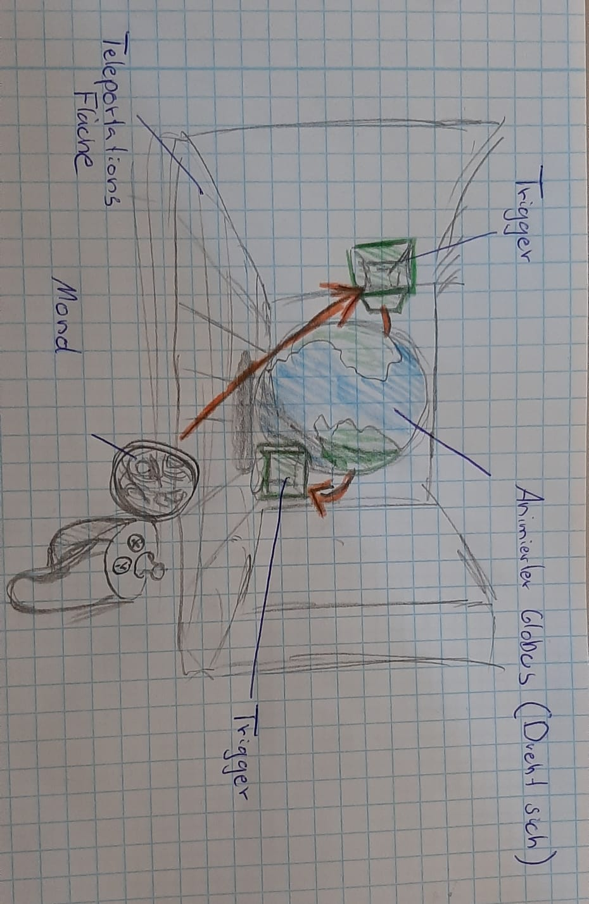

# VR Project for Oculus Rift

## Concept
A 3D globe is in the middle of a room. The goal is to shoot the moon in the right speed and from the right location to make it orbit around the globe correctly.  
  
### Controls
 + Press and hold joystick to teleport on the teleport area in the room.
 + Look around by moving your head with the Oculus Rift headset.
 + Press and hold the x or a button to increase the throw force and throw when released.

## Development platform
 + Windows 10 64 bit, GTX 960M, Intel i7 Quad-Core
 + Unity3D 2019.1.14f, API Compatibility Level .NET Standart 2.0, Scripting Runtime Version .NET 4.x Equivalent
 + Visual Studio Community 2019 16.4.2
 + Oculus Rift
 
## Target platfrom
 + Windows 10 64 bit
 + Oculus Rift

## Project state
1%

## Visuals

## Lessons Learned

## Limitatons

## Necessary setup/execution steps

## Third party material

**Copyright by Leonhard Schnaitl**
